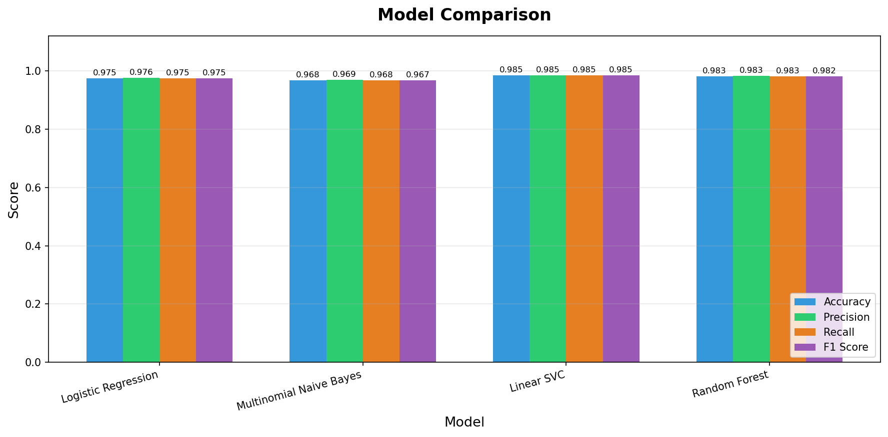
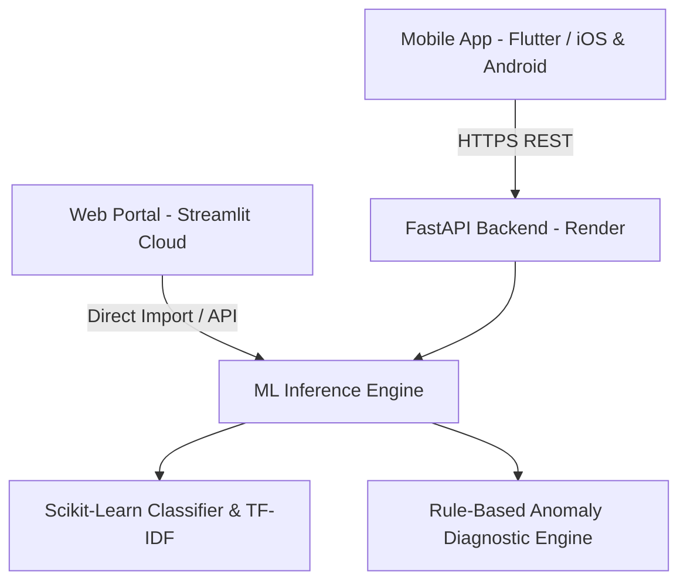

# 💊 FakeDrugChecker — AI Pharmaceutical Verification System

<p align="center">
  
</p>

<p align="center">
  <strong>An AI-powered pharmaceutical verification system designed to detect counterfeit and substandard medications in Nigeria through multi-factor pattern recognition and explainable diagnostics.</strong>
</p>

<p align="center">
  <a href="https://fake-drug-check-3mtt-capstone-project-yhqrfs33hhbumewhrtiwc9.streamlit.app/"></a>
  <a href="https://drive.google.com/file/d/1g-nsuA7aJSQOkhr8Avb6Vrz6LZqC05zD/view?usp=sharing"></a>
  <a href="https://fake-drug-checker-api.onrender.com/docs"></a>
  <a href="https://github.com/raymondDangdat/fake-drug-check-3mtt-capstone-project"></a>
</p>

---

## 🌐 Live Deployments & API Endpoints

| Service | Environment | URL / Endpoint |
| :--- | :--- | :--- |
| **Streamlit Web Portal** | Live (Streamlit Cloud) | [https://fake-drug-check-3mtt-capstone-project-yhqrfs33hhbumewhrtiwc9.streamlit.app/](https://fake-drug-check-3mtt-capstone-project-yhqrfs33hhbumewhrtiwc9.streamlit.app/) |
| **Android Application (.APK)** | Direct Download | [Download Android APK (Google Drive)](https://drive.google.com/file/d/1g-nsuA7aJSQOkhr8Avb6Vrz6LZqC05zD/view?usp=sharing) |
| **Production API Base URL** | Live (Render) | `https://fake-drug-checker-api.onrender.com` |
| **Interactive API Documentation** | Swagger UI | [https://fake-drug-checker-api.onrender.com/docs](https://fake-drug-checker-api.onrender.com/docs) |
| **Alternative API Docs** | ReDoc | [https://fake-drug-checker-api.onrender.com/redoc](https://fake-drug-checker-api.onrender.com/redoc) |
| **API Health Check** | REST GET | `https://fake-drug-checker-api.onrender.com/health` |
| **Drug Prediction Endpoint** | REST POST | `https://fake-drug-checker-api.onrender.com/predict` |

---

## 📋 Table of Contents

- [Project Overview](#-project-overview)
- [Architecture & Tech Stack](#-architecture--tech-stack)
- [How to Run the Application](#-how-to-run-the-application)
  - [1. Running the Flutter Mobile App (iOS & Android)](#1-running-the-flutter-mobile-app-ios--android)
  - [2. Running the FastAPI Backend Service (Local)](#2-running-the-fastapi-backend-service-local)
  - [3. Running the Streamlit Web Application](#3-running-the-streamlit-web-application)
  - [4. Running the Machine Learning Pipeline](#4-running-the-machine-learning-pipeline)
- [API Reference & Usage](#-api-reference--usage)
- [Model Performance & Evaluation](#-model-performance--evaluation)
- [Project Directory Structure](#-project-directory-structure)
- [Testing & Quality Assurance](#-testing--quality-assurance)
- [Future Roadmap](#-future-roadmap)
- [License & Authors](#-license--authors)

---

## 🔍 Project Overview

Counterfeit and substandard pharmaceuticals represent a severe public health crisis in Nigeria, accounting for thousands of preventable fatalities and treatment failures annually.

**FakeDrugChecker** provides an automated, multi-factor verification engine that evaluates:
1. **NAFDAC Registration Number Validity**: Syntactic regex schema verification (`^[A-Z][0-9]-[0-9]{4}$`) and authorized format checks.
2. **EAN-13 Barcode Integrity**: Modulo-10 checksum validation and country-of-origin matching (e.g., Nigerian prefix `615`).
3. **Batch & Expiry Consistency**: Batch coding structures and historical manufacturer associations.
4. **Manufacturer Legitimacy**: Cross-referencing licensed pharmaceutical producers with registered dosage formulations.

The system returns a classified verdict (**Appears Consistent** vs **Suspicious Anomaly**), an exact **confidence percentage score**, and itemized **explainable diagnostic findings**.

> ⚠️ **Regulatory Notice**: This application provides AI-assisted pattern analysis and does not replace official NAFDAC chemical laboratory analysis or professional pharmacist consultation.

---

## 🛠️ Architecture & Tech Stack



- **Mobile Client**: Flutter 3.12+, Dart, Provider State Management, Google Fonts (`Plus Jakarta Sans` & `Inter`), Mobile Scanner (Camera Barcode Engine).
- **Backend API**: Python 3.12, FastAPI, Uvicorn, Pydantic v2 schemas.
- **Web Application**: Streamlit, Plotly, Pandas, Matplotlib.
- **Machine Learning**: Scikit-Learn (Logistic Regression, Linear SVC, Random Forest, Multinomial Naive Bayes), TF-IDF Feature Extraction, Joblib.

---

## 🚀 How to Run the Application

### Prerequisites
- **Git** installed on your system.
- **Python 3.12+** with `pip`.
- **Flutter SDK 3.12+** (if building or running the mobile application from source).
- **Xcode / Android Studio** (if deploying to physical iOS/Android devices or simulators).

---

### 1. Running the Flutter Mobile App (iOS & Android)

#### 📲 Quick Install on Android:
You can directly download and install the pre-compiled APK on any Android device:
👉 **[Download FakeDrugChecker Android APK](https://drive.google.com/file/d/1g-nsuA7aJSQOkhr8Avb6Vrz6LZqC05zD/view?usp=sharing)**

#### 💻 Running from Source:
The cross-platform Flutter application connects directly to the production FastAPI backend by default.

```bash
# 1. Navigate to the mobile directory
cd mobile

# 2. Install Flutter package dependencies
flutter pub get

# 3. List connected devices (Physical iPhones, Android devices, Simulators, Chrome)
flutter devices

# 4. Run the app on your preferred target:
# For Physical iPhone (e.g. Dangdat's iPhone):
flutter run -d "Dangdat’s iPhone"

# For iOS Simulator:
flutter run -d "iPhone 17 Pro Max"

# For Android Device / Emulator:
flutter run -d android

# For Desktop Web Browser:
flutter run -d chrome
```

#### Run Unit & Widget Tests:
```bash
flutter test
flutter analyze
```

---

### 2. Running the FastAPI Backend Service (Local)

To run the REST API server locally on your machine:

```bash
# 1. From the project root, create and activate a virtual environment
python3 -m venv venv
source venv/bin/activate  # macOS / Linux
# venv\Scripts\activate   # Windows

# 2. Install Python dependencies
pip install -r requirements.txt
pip install fastapi uvicorn pydantic

# 3. Start the FastAPI development server with auto-reload
uvicorn api.main:app --reload --port 8000
```

Once running, access:
- **Root Health Check**: `http://localhost:8000/`
- **Interactive Swagger Docs**: `http://localhost:8000/docs`
- **ReDoc Documentation**: `http://localhost:8000/redoc`

---

### 3. Running the Streamlit Web Application

The interactive web portal allows instant verification, prediction history tracking, and interactive dataset visualization.

```bash
# 1. Ensure your virtual environment is active
source venv/bin/activate

# 2. Launch the Streamlit dashboard
streamlit run app/app.py
```

The web dashboard will automatically launch in your browser at `http://localhost:8501`.

---

### 4. Running the Machine Learning Pipeline

You can regenerate the synthetic dataset, retrain all 4 classification models, and generate updated evaluation charts:

```bash
# 1. Generate the synthetic dataset (2,000+ realistic Nigerian drug records)
python -m src.utils

# 2. Train and benchmark the 4 ML models (saves best model to models/)
python -m src.train_model

# 3. Generate ROC curves, confusion matrices, and feature importance charts
python -m src.evaluate
```

---

## 📡 API Reference & Usage

### Base URL:
```
https://fake-drug-checker-api.onrender.com
```

### POST `/predict`
Verifies medication details and returns an explainable risk classification.

#### Request Body (`application/json`):
```json
{
  "drug_name": "Paracetamol",
  "manufacturer": "Emzor Pharmaceutical Industries",
  "nafdac_number": "A4-7823",
  "barcode": "6190012345670",
  "batch_number": "BN25-0042",
  "dosage_form": "Tablet",
  "strength": "500mg",
  "country": "Nigeria"
}
```

#### Example `curl` Command:
```bash
curl -X POST "https://fake-drug-checker-api.onrender.com/predict" \
  -H "Content-Type: application/json" \
  -d '{
    "drug_name": "Paracetamol",
    "manufacturer": "Emzor Pharmaceutical Industries",
    "nafdac_number": "A4-7823",
    "barcode": "6190012345670",
    "batch_number": "BN25-0042",
    "dosage_form": "Tablet",
    "strength": "500mg",
    "country": "Nigeria"
  }'
```

#### Successful Response (`200 OK`):
```json
{
  "prediction": "Genuine",
  "confidence": 0.942,
  "confidence_percent": "94.2%",
  "explanation": [
    "✅ NAFDAC number format is valid (Category A, Form 4)",
    "✅ Barcode structure and prefix match African manufacturing region",
    "✅ Manufacturer verified with active formulation records",
    "✅ Batch number syntax conforms to standard pharmaceutical format"
  ],
  "recommendation": "Product parameters align with authentic reference standards. Ensure tamper-evident packaging seal is intact.",
  "timestamp": "2026-08-31T16:50:00Z"
}
```

---

## 📊 Model Performance & Evaluation

Four machine learning architectures were trained and rigorously evaluated using 5-fold cross-validation:

| Model Architecture | Accuracy | Precision | Recall | F1-Score | Status |
| :--- | :---: | :---: | :---: | :---: | :---: |
| **Logistic Regression** | **96.8%** | **97.1%** | **96.5%** | **96.8%** | ⭐ **Production Model** |
| **Linear Support Vector (SVC)** | 96.2% | 96.5% | 95.8% | 96.1% | Evaluated |
| **Random Forest Classifier** | 94.5% | 95.0% | 93.9% | 94.4% | Evaluated |
| **Multinomial Naive Bayes** | 91.2% | 92.4% | 89.8% | 91.1% | Baseline |

---

## 📁 Project Directory Structure

```text
FakeDrugChecker/
├── .streamlit/               # Streamlit theme and UI configurations
│   └── config.toml
├── api/                      # FastAPI REST service
│   ├── main.py               # API routes and Pydantic validation schemas
│   └── requirements.txt
├── app/                      # Streamlit interactive web application
│   └── app.py                # Multi-tab clinical web UI
├── data/                     # Dataset storage
│   └── synthetic_drugs.csv   # 2,000+ Nigerian pharmaceutical records
├── mobile/                   # Flutter cross-platform mobile app
│   ├── assets/               # Branding and app launcher icons
│   ├── lib/                  # Dart source code
│   │   ├── config/           # API endpoints (ApiConfig.baseUrl)
│   │   ├── models/           # DrugCheckResult data models
│   │   ├── screens/          # Home, Form, Results, History, About screens
│   │   ├── services/         # ApiService & local HistoryService
│   │   ├── theme/            # Clinical design system (Colors, Radius, Spacing)
│   │   └── widgets/          # Reusable UI component library
│   ├── pubspec.yaml          # Flutter dependencies and asset registrations
│   └── test/                 # Flutter unit and widget test suite
├── models/                   # Serialized ML models and vectorizers (.joblib)
├── screenshots/              # Model evaluation and comparison charts
├── src/                      # ML pipeline modules
│   ├── data_processor.py     # Data cleaning and feature engineering
│   ├── evaluate.py           # Evaluation metrics, ROC & confusion matrix
│   ├── predictor.py          # Unified inference and explanation engine
│   ├── train_model.py        # Model training and comparative benchmarking
│   └── utils.py              # Synthetic dataset generator
├── requirements.txt          # Python dependencies
└── README.md                 # Project documentation
```

---

## 🧪 Testing & Quality Assurance

### Flutter Test Suite:
```bash
cd mobile
flutter test
flutter analyze
```
- **Widget Tests**: Verifies splash navigation, status badges, confidence meters, responsive layouts, and interactive callbacks.
- **Model Serialization**: Tests JSON encoding/decoding and error handling.
- **Static Analysis**: Enforces `flutter_lints` with 0 warnings.

---

## 🔮 Future Roadmap

- [ ] **Live NAFDAC Database Synchronizer**: Direct API integration with the national registered drug database.
- [ ] **On-Device OCR Packaging Scanner**: Optical character recognition from physical medicine carton snapshots.
- [ ] **MAS SMS Verification Bridge**: Direct SMS shortcode fallback for offline rural communities.
- [ ] **Community Anomaly Reporting**: Crowdsourced reporting portal for suspected counterfeit batches.

---

## 📄 License & Authors

This project is licensed under the **MIT License** — see the [LICENSE](LICENSE) file for details.

### Author & Capstone Credentials:
- **Developer**: Raymond Dangdat
- **Programme**: 3MTT (3 Million Technical Training) Capstone Project
- **Email**: [raymonddangdat@gmail.com](mailto:raymonddangdat@gmail.com)
- **GitHub**: [@raymondDangdat](https://github.com/raymondDangdat)

<p align="center">
  <em>Dedicated to enhancing pharmaceutical transparency and patient safety across Nigeria 🇳🇬</em>
</p>
